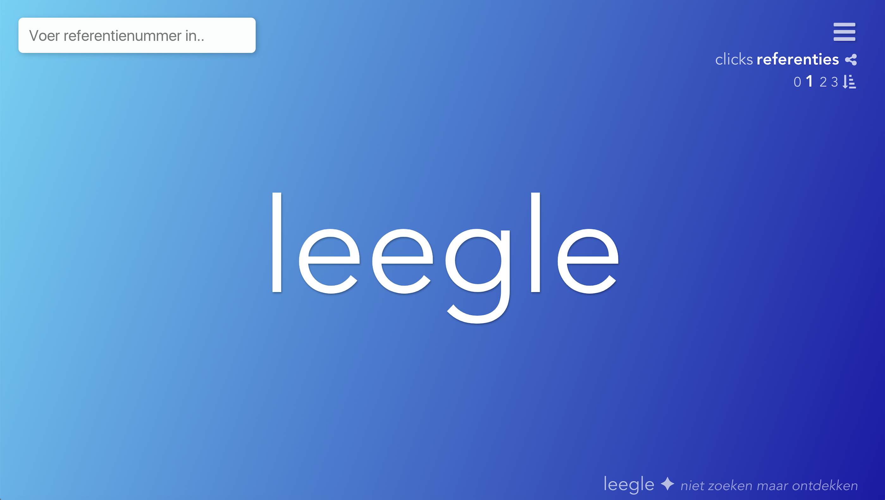
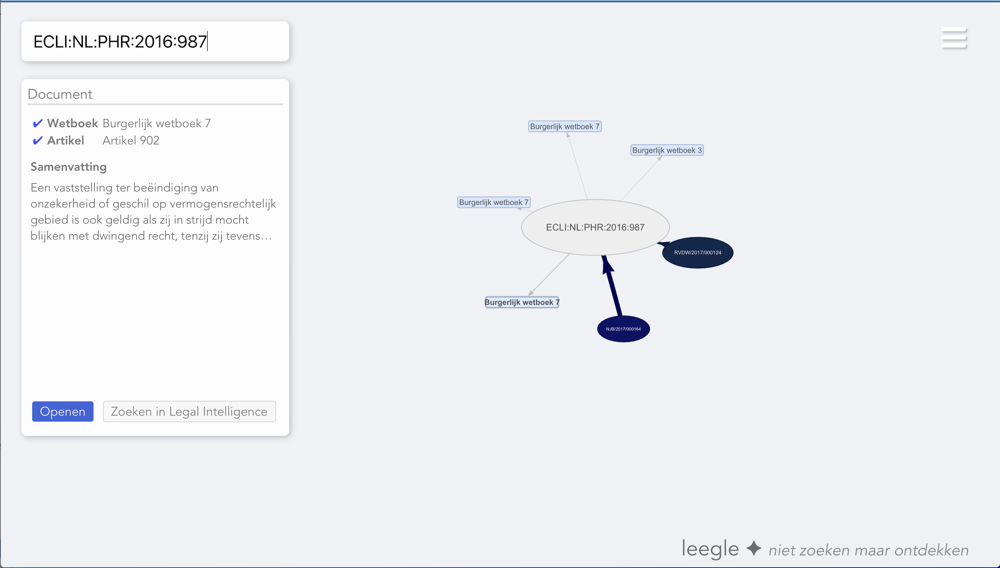
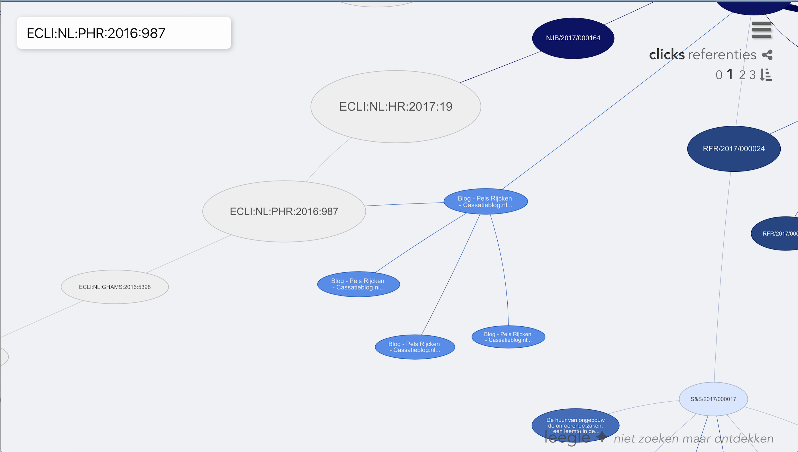

# Leegle

**Leegle** is a graph based search tool for legal documents. It was created in a 48 hour [hackathon](https://www.legalintelligence.com/hackathon) organised by [Legal Intelligence](https://www.legalintelligence.com) at the Clink hostel in Amsterdam, The Netherlands. It ended up winning the hackathon (€5000 prize).

## Tech
**Frontend:** Vue.JS 2, vis.js, animate  
**Backend:** Flask, Neo4J, Solr  
**Data processing and scraping:** pandas, requests, lxml  

## Contributors
We created this product with a team of 5 who studied or still study Computing Science (*Data Science* specialization) at [Radboud University](https://www.ru.nl), Nijmegen. Our team name was *"From RU with Love"*.

* Bas van Berkel ([basvb](https://github.com/basvb))
* Chris Kamphuis ([Chriskamphuis](https://github.com/Chriskamphuis))
* Timo van Niedek ([timovanniedek](https://github.com/timovanniedek))
* Joris van Vugt ([jvanvugt](https://github.com/jvanvugt))
* Guido Zuidhof ([gzuidhof](https://github.com/gzuidhof))
